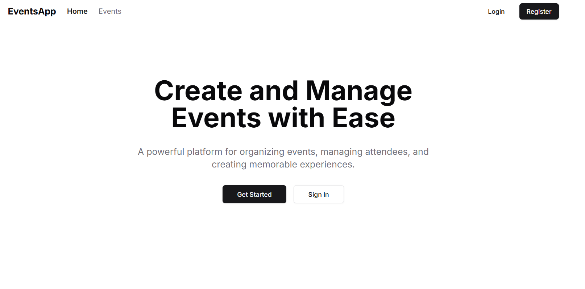

# Real-time Event Management Platform

<div align="center">
  <br />
  <a href="https://events-app-demo.vercel.app" target="_blank">
    
  </a>
  <br />

  <div>
    
    
    
    
    
  </div>

  <h3 align="center">A Modern Full-Stack Event Management Platform</h3>
</div>

## 📋 Table of Contents

1. 🤖 [Introduction](#introduction)
2. ⚙️ [Tech Stack](#tech-stack)
3. 🔋 [Features](#features)
4. 🤸 [Prerequisites](#prerequisites)
5. ⚡ [Environment Variables](#environment-variables)
6. 🚀 [Installation](#installation)

## 🤖 Introduction

A modern, full-stack event management platform built with Next.js 14 and React 18, featuring real-time updates and interactive features.

## ⚙️ Tech Stack

- **Frontend:** 
  - Next.js 14
  - React 18
  - TailwindCSS
  - Shadcn UI
  - Server-Sent Events (SSE) for real-time updates

- **Backend:**
  - Next.js API Routes
  - Server-Sent Events (SSE)
  - MongoDB with Mongoose
  - JWT Authentication
  - Cloudinary Integration

## 🔋 Key Features

- 🔐 **Advanced Authentication**
  - JWT-based authentication
  - Regular user registration/login
  - Guest user access with limited permissions
  - Protected routes and API endpoints

- 📅 **Event Management**
  - Create, edit, and delete events
  - Rich event details with image upload
  - Category-based organization
  - Attendee management with capacity limits
  - Real-time event updates using SSE

- ⚡ **Real-time Features**
  - Live updates for event changes
  - Real-time attendee list updates
  - Server-Sent Events for efficient real-time communication
  - Instant notifications

- 🎨 **Modern UI/UX**
  - Responsive design
  - Dark/light mode support
  - Toast notifications
  - Loading states and animations
  - Form validation
  - Interactive date picker
<!--
## 📊 Database Schema

### User Model
```javascript
{
  email: String,          // Required, unique
  password: String,       // Required, min length: 6
  name: String,          // Required
  isGuest: Boolean,      // Default: false
  createdEvents: [Event],// Reference to events created by user
  attendingEvents: [Event]// Reference to events user is attending
}
```

### Event Model
```javascript
{
  name: String,          // Required
  description: String,   // Required
  date: Date,           // Required
  location: String,      // Required
  category: String,      // Required, enum: ['music', 'sports', etc.]
  imageUrl: String,      // Required, Cloudinary URL
  creator: User,         // Required, reference to User
  attendees: [User],     // Array of User references
  maxAttendees: Number,  // Optional, for capacity limit
  status: String         // enum: ['upcoming', 'ongoing', 'completed', 'cancelled']
}
```-->

## 🤸 Prerequisites

- Node.js >= 18
- MongoDB Atlas Account
- Cloudinary Account

## ⚡ Environment Variables

Create a `.env.local` file with:

```env
MONGODB_URI=your_mongodb_uri
JWT_SECRET=your_jwt_secret
NEXT_PUBLIC_CLOUDINARY_CLOUD_NAME=your_cloudinary_cloud_name
CLOUDINARY_API_KEY=your_cloudinary_api_key
CLOUDINARY_API_SECRET=your_cloudinary_api_secret
```

## 🚀 Installation

1. Clone the repository:
   ```bash
   git clone <repository-url>
   cd event-management-platform
   ```

2. Install dependencies:
   ```bash
   npm install --legacy-peer-deps
   ```

3. Run the development server:
   ```bash
   npm run dev
   ```

## User Types

1. **Regular Users**
   - Full access to all features
   - Create and manage events
   - Register for events
   - Real-time updates

2. **Guest Users**
   - Limited access
   - Can view events
   - Can register for events
   - Cannot create/edit events

## API Routes

- **Authentication**
  - \`POST /api/auth/register\` - Register new user
  - \`POST /api/auth/login\` - User login
  - \`POST /api/auth/guest\` - Guest login

- **Events**
  - \`GET /api/events\` - List events with filters
  - \`POST /api/events\` - Create event
  - \`GET /api/events/[id]\` - Get event details
  - \`PUT /api/events/[id]\` - Update event
  - \`DELETE /api/events/[id]\` - Delete event
  - \`POST /api/events/[id]/attend\` - Register/unregister attendance

---
